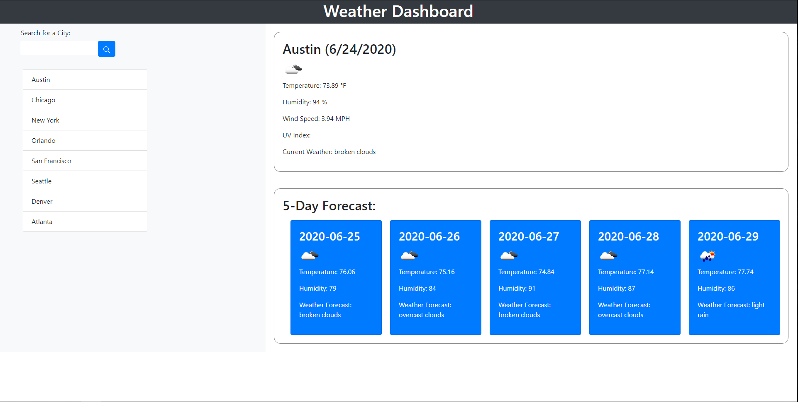

# Weather_Dashboard_TJB

This project is a weather dashboard.  IT allows you to input a city to search, it will then find the current weather data for that city.  It also shows to the next 5 day forcast of the searched city.  The UV Index will change color depending on how high or low the UV index is.

 https://tanjamboy.github.io/Weather_Dashboard_TJB/

